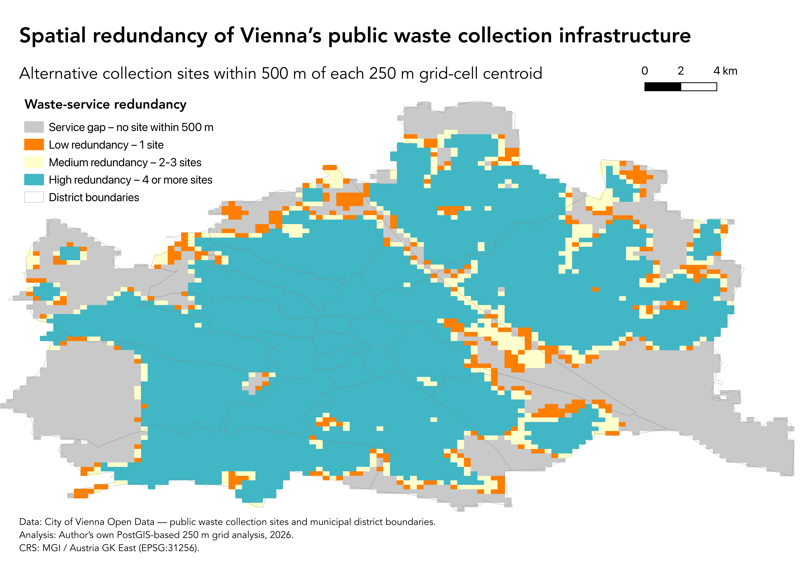

::: {.hero-section}

::: {.grid}

::: {.g-col-12 .g-col-md-7}

Urban geography · Spatial analysis · Social sustainability

# Patricia Tschebann

## Spatial analysis for socially sustainable cities

I am a Vienna-based geographer and master's student in *Geographies of Global Change and Sustainability Transformations* at the University of Vienna.

My work combines GIS and spatial data analysis with urban research to investigate accessibility, environmental justice and socially sustainable urban development.

[Explore my projects](projects.qmd){.btn .btn-primary}
[About me](about.qmd){.btn .btn-outline-secondary}

:::

::: {.g-col-12 .g-col-md-5}

[{.hero-map fig-alt="Map showing spatial redundancy of Vienna's public waste collection infrastructure."}](projects/vienna-waste-resilience.qmd)

:::

:::

:::

::: {.content-section}

## Areas of focus

::: {.grid}

::: {.g-col-12 .g-col-md-4 .focus-card}

### Spatial analysis

GIS-based analysis of accessibility, infrastructure provision and spatial inequality using QGIS, ArcGIS Pro, PostgreSQL/PostGIS and SQL.

:::

::: {.g-col-12 .g-col-md-4 .focus-card}

### Urban research

Research on housing, public space, everyday infrastructure and urban transformation using quantitative and qualitative methods.

:::

::: {.g-col-12 .g-col-md-4 .focus-card}

### Sustainability

Analysis of environmental justice, urban resilience and socially sustainable planning across different spatial contexts.

:::

:::

## Featured project

### Vienna Waste Resilience

A PostGIS-based analysis of spatial redundancy and backup accessibility within Vienna's public waste collection infrastructure.

[View project](projects/vienna-waste-resilience.qmd)

:::